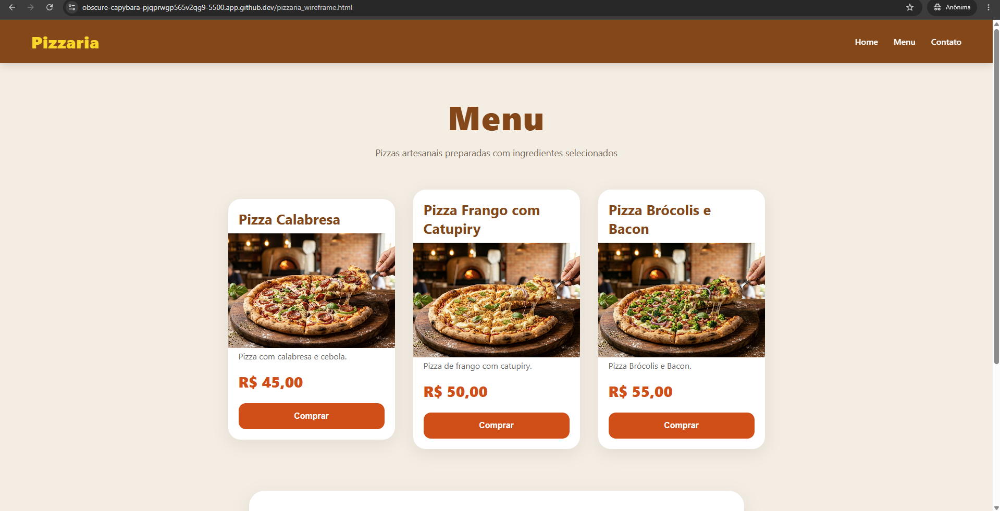
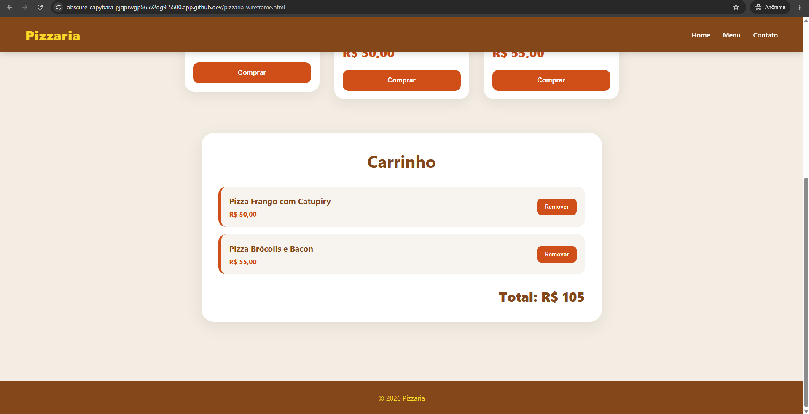
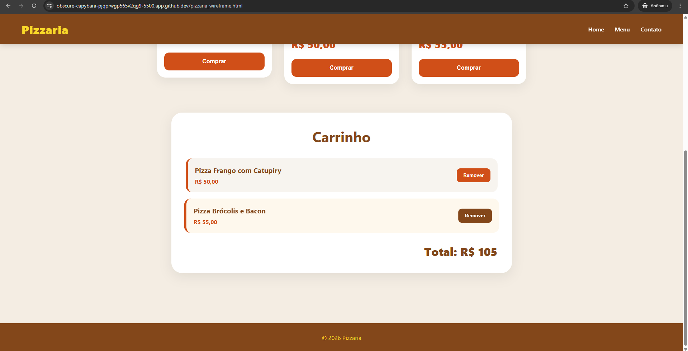

# Pizzaria - Atividade 1

## Descrição
Projeto desenvolvido em JavaScript para gerenciamento de carrinho de compras de uma pizzaria.

Nesta atividade foi implementada a funcionalidade de remover pizzas individualmente do carrinho utilizando manipulação do DOM e eventos JavaScript.

---

## Funcionalidades

- Adicionar pizzas ao carrinho
- Remover pizzas individualmente
- Atualização automática do total
- Atualização dinâmica do DOM sem recarregar a página
- Interface responsiva

---

## Tecnologias Utilizadas

- HTML5
- CSS3
- JavaScript

---

## Como Executar pelo Terminal

### 1. Abrir o projeto no VSCode ou GitHub Codespaces

### 2. Abrir o terminal

### 3. Executar o comando:

```bash
python3 -m http.server 5500
```

### 4. Abrir no navegador:

```bash
http://localhost:5500
```

---

## Prints do Projeto





